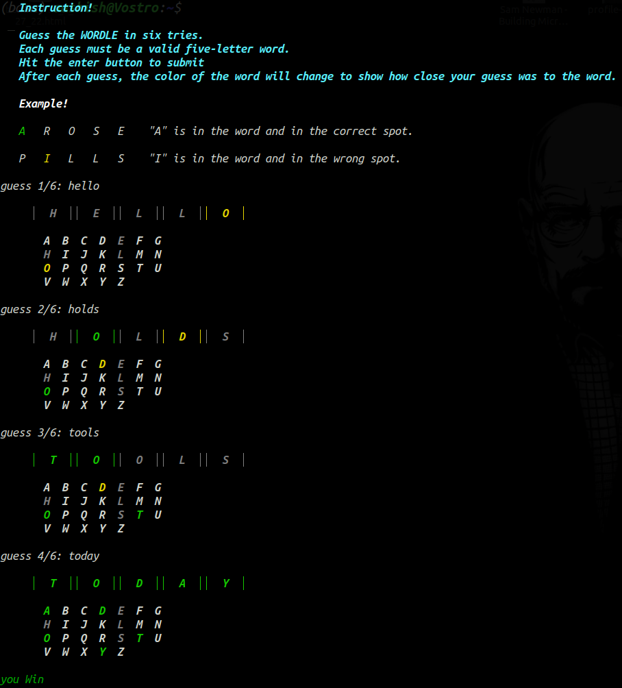

# wordle-cli
Play wordle in your terminal
# Installation
### For Ubuntu
* Download .deb file from [Here](https://github.com/ashish336b/wordle-cli/releases/download/v1.0.0/wordle_v0.0.7-1_amd64.deb) the link below and install it.

### For Mac OS
```bash
brew install ashish336b/wordle/wordle
```
## USAGE
* To play official wordle game
```bash 
wordle 
```
* To play random wordle game
```bash
wordle random
```
* To show possible command
```bash
wordle -help
```
# PREVIEW

